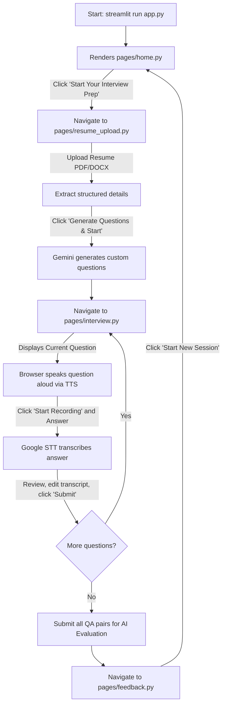

# AI Voice Mock Interview Studio - Technical Documentation

This documentation provides a comprehensive architectural and operational breakdown of the **AI Voice Mock Interview Studio** project. It is structured to serve as a complete reference for software engineers, software architects, and AI agents (such as NotebookLM) to understand the codebase and execution patterns of the application.

---

## 1. Project Overview

### Purpose
The **AI Voice Mock Interview Studio** is a lightweight, responsive web application designed to help job applicants prepare for technical and behavioral interviews. By simulating a real-world verbal interview experience, it provides users with custom-generated questions, real-time voice-to-text recording, browser-based speech output, and deep, metric-driven AI feedback.

### Problem Solved
Traditional interview preparation is often passive (reading blogs, writing code on paper) or expensive (hiring human mock interview coaches). This application bridges the gap by offering an interactive, verbal, and highly personalized interview simulator that behaves like a human interviewer. It does this completely for free, using client-side browser capabilities and the Gemini API, requiring no local database configurations or expensive server hosting.

### Target Users
* **Students & Recent Graduates:** Mapped as an MCA major project or developer tool, helping new developers prepare for placement drives.
* **Job Seekers:** Developers wishing to practice speaking technical explanations clearly.
* **Hiring Managers / Recruiters:** Practicing customized role-based screening before actual calls.

### Major Features
1. **Dynamic Resume Parsing:** Extract details (Name, Skills, Projects, Experience, Education) from uploaded PDF and DOCX files.
2. **Context-Locked AI Question Generation:** Gemini analyzes the candidate's parsed resume details and generates structured interview questions tailored specifically to the user's background and target role.
3. **Interactive Audio Playback (TTS):** Automatically reads each question aloud inside the candidate's browser using HTML5 SpeechSynthesis.
4. **Voice Recording & Live Transcription (STT):** Records the candidate's voice answer, performs voice-to-text transcription, and prints the result instantly in an editable text area.
5. **Granular Performance Evaluation:** Gemini evaluates the candidate's answers based on Communication, Technical Knowledge, Confidence, Completeness, and Grammar, scoring them out of 100 and providing a study roadmap.

---

## 2. Technology Stack

* **Frontend & Framework:**
  * **Streamlit (v1.36.0+):** Utilized for fast UI rendering, layouts, and session state management.
  * **HTML5 Web Speech API (SpeechSynthesis):** Provides client-side, zero-dependency, and free Text-to-Speech (TTS) audio.
* **Speech-to-Text (STT):**
  * **streamlit-mic-recorder:** Renders browser mic interfaces. It transfers audio streams as WAV files to the backend where it interfaces with the free Google Speech Recognition Web API.
* **AI Engine:**
  * **google-genai (v0.6.0+):** The official, modern Google GenAI Python SDK. Used to connect to Gemini.
  * **Gemini 3.5 Flash (`models/gemini-3.5-flash`):** Serves as the centralized AI model for question generation and multi-metric interview evaluation.
* **Resume Parser:**
  * **pdfplumber:** Extracted line-by-line structured text from PDF documents.
  * **python-docx:** Extracted text paragraphs from DOCX documents.
* **Configuration & Styling:**
  * **python-dotenv:** Loads credentials and settings from `.env` files.
  * **Vanilla CSS:** Applied via Streamlit markdown injections to provide a dark-mode glassmorphism theme with premium badges, button hovers, and custom grids.

---

## 3. Folder Structure

Below is the directory tree of the refactored, production-ready project:

```text
AI Voice Mock Interview Platform/
│
├── .env                         # Local environment configuration for API secrets
├── .env.example                 # Environment template for model and API configurations
├── .gitignore                   # Excludes venv, private keys, local uploads, and cache folders
├── app.py                       # Main application script and page router
├── requirements.txt             # Centralized list of core package dependencies
│
├── .streamlit/
│   └── config.toml              # Streamlit client settings (hides default navigation)
│
├── assets/                      # Media, icons, and static assets
│
├── components/
│   └── __init__.py              # Initializer for reusable components package
│
├── pages/
│   ├── __init__.py              # Initializer for pages package
│   ├── feedback.py              # Page displaying AI evaluation dashboard
│   ├── home.py                  # Landing page with feature showcases
│   ├── interview.py             # Active voice-guided interview session dashboard
│   └── resume_upload.py         # Resume parsing and setup page
│
├── services/
│   ├── __init__.py              # Initializer for services package
│   │
│   ├── ai/
│   │   ├── __init__.py          # Initializer for AI services
│   │   ├── gemini_service.py    # Main Gemini question & evaluation handler
│   │   └── test_gemini.py       # Helper script to validate model availability
│   │
│   ├── parsing/
│   │   ├── __init__.py          # Initializer for resume parsing
│   │   ├── constants.py         # Parsing patterns and section heading aliases
│   │   ├── resume_parser.py     # Main parser coordinate logic
│   │   ├── section_parser.py    # Section mapping and detail heuristics
│   │   └── text_extractors.py   # PDF / DOCX byte readers
│   │
│   └── voice/
│       ├── __init__.py          # Initializer for voice services
│       ├── session.py           # In-memory session logging utilities
│       └── tts.py               # HTML/JS browser Text-To-Speech utility
│
├── uploads/
│   └── .gitkeep                 # Preserves the directory structure for files
│
└── utils/
    ├── __init__.py              # Initializer for utils package
    ├── formatting.py            # Safe data casting and name-scrubbing utils
    ├── settings.py              # Environment variable loading settings
    └── ui.py                    # Custom dark-theme CSS and global UI wrappers
```

### Purpose of Folders
* **`.streamlit/`**: Houses global configurations to customize Streamlit's runtime behavior.
* **`assets/`**: Keeps static files (e.g. icons, backgrounds) clean.
* **`components/`**: Placeholders for isolated, reusable UI widgets.
* **`pages/`**: Contains the visual dashboards of the app, corresponding to the linear interview steps.
* **`services/`**: Holds core business logic separated by domains (AI integration, File Parsing, Voice Subsystems).
* **`uploads/`**: Serves as a local workspace for temporary files during resume parsing.
* **`utils/`**: General helper scripts for styling, type-safe casting, and variable environment resolution.

---

## 4. File-by-File Explanation

### Root Files

#### `app.py`
* **Purpose:** The central controller. Sets up the Streamlit page metadata, registers the pages package, loads custom CSS, and uses state routing to render the current step.
* **Classes:** None.
* **Functions:** None (runs top-level orchestration).
* **Inputs:** Read from `st.session_state["active_page"]`.
* **Outputs:** Dynamic UI rendering on the webpage.
* **Dependencies:** `streamlit`, `utils.ui`, `pages`.

#### `requirements.txt`
* **Purpose:** Lists python packages required by the application.
* **Dependencies:** `streamlit`, `google-genai`, `pdfplumber`, `python-docx`, `python-dotenv`, `streamlit-mic-recorder`, `soundfile`.

#### `.env` / `.env.example`
* **Purpose:** Declares environmental keys (`GEMINI_API_KEY`, `GEMINI_MODEL`).

#### `.streamlit/config.toml`
* **Purpose:** Customizes Client configuration. Specifically sets `showSidebarNavigation = false` to disable the default page links, locking the user to the custom wizard dashboard buttons.

---

### Pages Module (`pages/`)

#### `pages/home.py`
* **Purpose:** Renders the glassmorphic product landing page. Contains product feature highlights and a call-to-action button.
* **Classes:** None.
* **Functions:** `render()` - draws the HTML hero layout and handles transition to "Resume Upload".
* **Inputs:** None.
* **Outputs:** Streamlit page content.
* **Dependencies:** `streamlit`, `utils.ui`.

#### `pages/resume_upload.py`
* **Purpose:** Handles resume drag-and-drop upload, triggers text parsing, displays a detailed preview of parsed details, collects interview settings, and generates questions using Gemini.
* **Classes:** None.
* **Functions:** `render()` - draws parsing layout and settings form.
* **Inputs:** Uploaded document stream, inputs for Role, Level, Difficulty, and Question Count.
* **Outputs:** Extracted resume data in `st.session_state["resume_data"]`, generated questions list in `st.session_state["voice_questions"]`.
* **Dependencies:** `streamlit`, `services.parsing.resume_parser`, `services.ai.gemini_service`, `services.voice.session`, `utils.ui`.

#### `pages/interview.py`
* **Purpose:** Orchestrates the voice interview session. Handles displaying questions, injecting TTS, processing STT voice inputs, allowing edit reviews, submitting, skipping, and final evaluation generation.
* **Classes:** None.
* **Functions:** `render()` - draws the interview workflow dashboard.
* **Inputs:** Spoken microphone input or keyboard text.
* **Outputs:** Saves transcripts in session state, pushes evaluation results to `st.session_state["evaluation_results"]`.
* **Dependencies:** `streamlit`, `streamlit_mic_recorder`, `services.voice`, `services.ai.gemini_service`, `utils.ui`.

#### `pages/feedback.py`
* **Purpose:** Displays the comprehensive assessment results (radial rating score, dimensional skill progress bars, strengths, weaknesses, tips, study study path roadmap).
* **Classes:** None.
* **Functions:** `render()` - draws cards for Gemini feedback parameters and handles reset capabilities.
* **Inputs:** Read from `st.session_state["evaluation_results"]`.
* **Outputs:** Renders feedback cards.
* **Dependencies:** `streamlit`, `utils.ui`.

---

### AI Service Module (`services/ai/`)

#### `services/ai/gemini_service.py`
* **Purpose:** Main coordinate interface with the Google GenAI API client. Handles prompts, queries, error fallbacks, and responses parsing.
* **Classes:** `GeminiServiceError` (inherits `RuntimeError`), `GeminiService` (encapsulates client calls).
* **Functions:**
  * `__init__(api_key, model)`: Sets key/model using environment overrides.
  * `_get_client(api_key)`: Instantiates Google GenAI client.
  * `generate_questions(resume_data, role, experience_level, difficulty, count, api_key)`: Builds prompt, invokes Gemini, returns structured question list.
  * `evaluate_answers(resume_data, qa_pairs, role, api_key)`: Sends interview dialogue context to Gemini, returns evaluation dict.
  * `_parse_json_response(raw_text)`: Extracts JSON text from raw response strings.
  * `_normalize_questions(questions, count)`: Sanitizes question attributes.
  * `_normalize_evaluation(data)`: Normalizes feedback dictionaries to prevent runtime data-key issues.
* **Inputs:** Variables for resumes, questions, answers, and role configurations.
* **Outputs:** Dictionary representing normalized JSON objects.
* **Dependencies:** `google.genai`, `utils.settings`, `streamlit`, `json`, `re`.

#### `services/ai/test_gemini.py`
* **Purpose:** A diagnostic command-line utility to verify that the Gemini API key is configured correctly and has valid model quota access.

---

### Parsing Service Module (`services/parsing/`)

#### `services/parsing/constants.py`
* **Purpose:** Declares regular expressions for contact patterns (email, phone) and list mappings matching section titles.
* **Dependencies:** `re`.

#### `services/parsing/text_extractors.py`
* **Purpose:** Extracts raw text string from binary input streams of PDF and Word files.
* **Classes:** None.
* **Functions:**
  * `extract_text_from_pdf_bytes(file_bytes)`: Uses `pdfplumber` to read pages.
  * `extract_text_from_docx_bytes(file_bytes)`: Uses `python-docx` to read paragraphs.
  * `extract_text_from_file(file_path)`: Resolves text extraction using file paths.
  * `extract_text_from_bytes(file_name, file_bytes)`: Resolves text extraction using binary streams.
* **Inputs:** File byte data.
* **Outputs:** Unified raw text string.
* **Dependencies:** `pdfplumber`, `docx`, `io.BytesIO`.

#### `services/parsing/section_parser.py`
* **Purpose:** Separates raw resume text into categories like Education, Skills, and Projects using heading keyword matching.
* **Classes:** None.
* **Functions:**
  * `normalize_lines(text)`: Scrubs spacing and splits lines.
  * `extract_email(text)` / `extract_phone(text)`: Executes regex matches.
  * `guess_name(lines, email, phone)`: Analyzes header lines to locate the candidate's name.
  * `parse_sections(text)`: Segregates paragraph blocks based on heading keywords.
  * `flatten_section_items(section_lines)`: Scrubs prefix characters (bullet points, dashes).
  * `parse_structured_fields(text)`: Runs all extraction coordinates.
* **Inputs:** Raw text string.
* **Outputs:** Structure fields dictionary.
* **Dependencies:** `services.parsing.constants`.

#### `services/parsing/resume_parser.py`
* **Purpose:** Coordinates the extraction process from file bytes to a dictionary of fields, encapsulating the parsed datetime.
* **Classes:** `ParsedResume` (a Dataclass containing structured properties).
* **Functions:**
  * `parse_resume_text(text, source_file_name)`: Maps extracted sections to `ParsedResume`.
  * `parse_resume_bytes(file_name, file_bytes)`: Coordinates extraction and mapping from bytes.
  * `parse_resume_file(file_path)`: Coordinates extraction and mapping from file paths.
* **Inputs:** File context details.
* **Outputs:** Mapped metadata dictionary.
* **Dependencies:** `services.parsing.section_parser`, `services.parsing.text_extractors`.

---

### Voice Service Module (`services/voice/`)

#### `services/voice/session.py`
* **Purpose:** Handles the in-memory progress indicators, indices, and transcripts for the active interview.
* **Classes:** None.
* **Functions:**
  * `initialize_voice_session()`: Configures default session state keys.
  * `load_voice_questions(questions, question_set)`: Sets active question list and resets progress.
  * `set_voice_interview_context(resume_text, role)`: Saves active interview metadata.
  * `get_current_voice_question()`: Retrieves active question dictionary.
  * `advance_voice_question(step)`: Increments the question index safely.
  * `repeat_voice_question()`: Clears active audio flag to trigger replay.
  * `mark_voice_answer(answer_text, status)`: Logs user answers in state.
  * `end_voice_interview()`: Flags the interview state as ended.
  * `get_voice_progress()`: Returns question metrics (total, current, answered).
* **Dependencies:** `streamlit`, `datetime`.

#### `services/voice/tts.py`
* **Purpose:** Provides client-side Text-To-Speech (TTS) using custom Javascript injected via `components.html`.
* **Classes:** None.
* **Functions:** `render_text_to_speech(text, language, rate, pitch)` - Injects JavaScript using `SpeechSynthesisUtterance`.
* **Inputs:** The text string to read, audio settings.
* **Outputs:** Executes JavaScript on the client's browser.
* **Dependencies:** `streamlit.components.v1`, `json`.

---

### Utilities Module (`utils/`)

#### `utils/settings.py`
* **Purpose:** Fetches global configurations and API keys from `.env` or system environment.
* **Classes:** `Settings` (Dataclass).
* **Functions:** `get_settings()` - loads settings with `@lru_cache`.
* **Dependencies:** `os`, `dotenv`, `dataclasses`, `functools`.

#### `utils/formatting.py`
* **Purpose:** Basic data casting helpers.
* **Classes:** None.
* **Functions:**
  * `to_int(value, default)`: Safely casts to integer.
  * `format_timestamp(value, pattern, default)`: Formats datetime formats safely.
  * `safe_filename(value, fallback)`: Normalizes filenames.
  * `unique_non_empty(values)`: De-duplicates lists of strings.
* **Dependencies:** `re`, `datetime`, `pandas`.

#### `utils/ui.py`
* **Purpose:** Declares glassmorphism styling templates and registers the custom navigation sidebar wrapper.
* **Classes:** None.
* **Functions:**
  * `apply_theme()`: Injects custom CSS stylesheets.
  * `render_sidebar(active_page)`: Renders navigation buttons linked to `active_page` state.
  * `render_hero(title, subtitle, eyebrow)`: Renders a glassmorphic dashboard hero card.
  * `render_kpis(items)`: Renders stats grids.
  * `render_feature_grid(features)`: Renders feature blocks.
* **Dependencies:** `streamlit`, `datetime`, `utils.settings`.

---

## 5. Application Workflow

When the system runs:



1. **Initialization:** Run `streamlit run app.py`. Streamlit configures the page configuration and applies the glassmorphic dark theme.
2. **Landing Page:** Renders `pages/home.py` explaining the features. The user clicks "Start Your Interview Prep".
3. **Resume Intake:** Renders `pages/resume_upload.py`. The user drops their PDF or DOCX file, which is parsed and mapped. The user adjusts Target Role, Level, and Difficulty, then clicks "Start".
4. **Question Hook:** `GeminiService` constructs a prompt with the parsed resume details, requesting custom questions. The generated questions list is saved to the session state.
5. **Interview Dashboard:** The page transitions to `pages/interview.py`.
6. **Verbal Guide:** The current question text is displayed on screen, and `render_text_to_speech` triggers the client's browser to read the question.
7. **Microphone Intake:** The candidate clicks the microphone widget, speaks, and clicks stop. The audio WAV file is sent to the server.
8. **Live transcription:** Google STT transcribes the WAV file, updating the text area on screen. The candidate can edit it manually.
9. **Loop Navigation:** When "Submit" is clicked, progress increments, and the next question loads, repeating steps 6–8.
10. **Assessment Generation:** After the last question, the user clicks "Generate Detailed AI Feedback Report". Gemini processes the resume and the complete Q&A dialogue.
11. **Evaluation Dashboard:** Transitions to `pages/feedback.py`, drawing overall scores, category metrics, and a study roadmap. The user can click reset to return to the landing page.

---

## 6. User Workflow

The candidate interacts with the application linearly:

```text
Open Application (Landing Page)
   │
   ▼
Upload PDF/DOCX Resume
   │
   ▼
Verify parsed Details (Name, Skills, Projects, Education)
   │
   ▼
Configure target Role, Experience Level, and Difficulty
   │
   ▼
Start Interview Session
   │
   ▼
For each question:
   ├─► Listen to question spoken aloud
   ├─► Click "Start Recording" & speak response
   ├─► Review and edit transcription text
   └─► Click "Submit" to advance
   │
   ▼
Review detailed AI Feedback Report (Scores, Strengths, Recommendations)
   │
   ▼
Click "New Session" to restart
```

---

## 7. Backend Workflow

When the user takes an action, the backend performs the following:

1. **File Upload:**
   * Reads raw bytes of PDF/DOCX.
   * `text_extractors` reads text paragraphs or lines.
   * `section_parser` executes regex patterns to parse name, email, phone, and parses headings matching aliases to isolate skills, projects, and work history.
2. **Clicking "Generate Questions":**
   * Prepares a JSON prompt locking the generator to the parsed resume fields.
   * Calls `google-genai` using the key in `.env` and `models/gemini-3.5-flash`.
   * Standardizes the returned string into a list of dictionaries with safety fallbacks.
3. **Question Load:**
   * Checks `voice_last_spoken_index`. If changed, injects an HTML iframe containing JavaScript SpeechSynthesis code.
   * Renders the STT micro-recorder widget with a unique key matching the index.
4. **Recording Audio:**
   * Receives binary audio bytes.
   * Sends audio bytes to Google Web Speech API.
   * Receives transcription text, updates `st.session_state[f"text_area_{current_idx}"]` directly, forcing the UI text area widget to re-render.
5. **Clicking "Generate Feedback":**
   * Combines resume detail cards and Q&A transcripts into a structured prompt.
   * Gemini evaluates performance criteria, formatting the response into a JSON structure containing scores, strengths, weaknesses, and roadmap items.
   * Saves the formatted output in memory.

---

## 8. Component Interaction

The app uses standard dependency flows to communicate between layers:

```text
       ┌───────────┐
       │  app.py   │ ◄─────── Coordinates page rendering
       └─────┬─────┘
             │ (Routes pages based on state keys)
             ▼
       ┌───────────┐
       │   pages/  │ ◄─────── Collects inputs and renders forms
       └─────┬─────┘
             │ (Calls services for calculations & data parsing)
             ▼
       ┌───────────┐
       │ services/ │ ◄─────── AI, Parsing, and Voice logic
       └─────┬─────┘
             │ (Resolves formatting configurations & themes)
             ▼
       ┌───────────┐
       │  utils/   │ ◄─────── Theme CSS, settings, and types
       └───────────┘
```

* **`app.py`** is the master router. It references `utils.ui` for CSS structure and imports `pages` dynamically.
* **`pages`** retrieve and update configuration fields. They display layouts and forward parsed data structures to **`services`**.
* **`services`** represent pure functional engines. They do not maintain layout details. They execute file reads, Gemini requests, and state modifications.
* **`utils`** provide central services. They fetch configuration variables, format text, and inject CSS styles.

---

## 9. API Usage

### Gemini API (`google-genai` SDK)
* **What it does:** Generates interview questions based on the candidate's resume and evaluates candidate responses across several metrics.
* **Integration:** Uses the `models/gemini-3.5-flash` model. Prompts instruct the model to return raw, unformatted JSON matching a strict schema.

### Google Speech Recognition Web API (STT)
* **What it does:** Converts recorded audio files into text.
* **Integration:** Interfaced via `streamlit-mic-recorder`'s `speech_to_text()` widget. Transcription is free and does not require credentials.

### Web Speech API - SpeechSynthesis (TTS)
* **What it does:** Translates text to synthesized speech.
* **Integration:** Handled in JavaScript via `window.speechSynthesis` and `SpeechSynthesisUtterance`. It is client-side, runs in the user's browser, and requires no API keys.

---

## 10. Session State

| State Variable | Type | Purpose |
| :--- | :--- | :--- |
| `active_page` | `str` | Handles state navigation ("Home", "Resume Upload", "Interview", "Final Feedback"). |
| `resume_data` | `dict` | Holds extracted details from the candidate's resume. |
| `target_role` | `str` | Target job role configured by the user (e.g. Software Engineer). |
| `experience_level` | `str` | Candidate experience tier. |
| `difficulty` | `str` | Interview question difficulty level. |
| `num_questions` | `int` | Number of questions requested (3 to 10). |
| `voice_questions` | `list` | Contains the generated interview question list. |
| `voice_question_index`| `int` | Tracks the active question number. |
| `voice_transcript` | `list` | Holds structured answers, timestamps, and skip indicators. |
| `voice_ended` | `bool` | Flag stating whether the interview questions are complete. |
| `voice_last_spoken_index`| `int` | Prevents TTS from repeating a question during unrelated page reruns. |
| `evaluation_results` | `dict` | Holds the final assessment data returned by Gemini. |
| `custom_gemini_api_key`| `str` | Custom API key provided by the user in the sidebar (if `.env` key is missing). |

---

## 11. Data Flow

```text
[Resume PDF/Word] ──► Text Extractors ──► Raw Text ──► Section Parser
                                                             │
                                                             ▼
                                                    [Structured Dict]
                                                             │ (Inputs: Role, Level)
                                                             ▼
                                                      Gemini Service
                                                             │ (Model: gemini-3.5-flash)
                                                             ▼
                                                     [Question List]
                                                             │
                                                             ▼
                                                    Active Voice Loop
                                         (TTS audio out ◄───┤───► STT audio in)
                                                            │
                                                            ▼
                                                     [Transcript Log]
                                                            │ (Evaluates all QA pairs)
                                                            ▼
                                                      Gemini Service
                                                            │
                                                            ▼
                                                   [Feedback Dashboard]
```

---

## 12. Important Classes

### `GeminiService` (in `services/ai/gemini_service.py`)
* **Purpose:** Handles connections to Google GenAI, validates credentials, format prompts, and normalizes JSON data structures.
* **Key Attributes:**
  * `self.api_key`: Resolved credentials.
  * `self.model`: Selected AI model (defaults to `models/gemini-3.5-flash`).
  * `self.client`: Google GenAI API client instance.

---

## 13. Important Functions

### `parse_resume_bytes` (in `services/parsing/resume_parser.py`)
* **Inputs:** `file_name` (str), `file_bytes` (bytes)
* **Outputs:** Dictionary representing extracted sections.
* **Description:** Extracts raw text, maps it to a structured format (Name, Email, Phone, Skills, Projects, Experience, Education), and casts it to a clean dictionary.

### `generate_questions` (in `services/ai/gemini_service.py`)
* **Inputs:** `resume_data` (dict), `role` (str), `experience_level` (str), `difficulty` (str), `count` (int)
* **Outputs:** List of dictionaries containing questions.
* **Description:** Formulates a prompt with resume context, queries Gemini, extracts raw JSON, and normalizes questions.

### `evaluate_answers` (in `services/ai/gemini_service.py`)
* **Inputs:** `resume_data` (dict), `qa_pairs` (list), `role` (str)
* **Outputs:** Dictionary representing assessment metrics.
* **Description:** Submits the candidate's resume and the complete interview Q&A transcript to Gemini, returning a structured performance review.

### `render_text_to_speech` (in `services/voice/tts.py`)
* **Inputs:** `text` (str), `language` (str), `rate` (float), `pitch` (float)
* **Outputs:** None (renders browser iframe).
* **Description:** Injects JavaScript to play the text string using the browser's speech synthesis engine.

---

## 14. Interview Flow

The active interview pipeline uses a state-driven loop inside `pages/interview.py`:

1. **Fetch Question:** Resolves `get_current_voice_question()`. Renders text inside a glassmorphic card.
2. **Trigger Voice:** Compares `voice_last_spoken_index` with the current index. If not equal, runs browser TTS to read the question.
3. **Intake response:** Renders `speech_to_text()`. When the candidate records and stops, the transcription updates the review textbox.
4. **User Correction:** The candidate can review the transcribed answer and edit it directly in the text area if needed.
5. **Progress Logic:**
   * **On Submit:** Calls `mark_voice_answer(ans, status="answered")`. If on the last question, sets `voice_ended = True`. Otherwise, advances progress by 1.
   * **On Skip:** Logs answer as skipped, advances index.
   * **On Retry:** Clears state variables to allow re-recording.
   * Reruns the app to refresh state and load the next question.

---

## 15. AI Logic

### Prompt Engineering
* **Question Generation:** Instructs Gemini to act as an interviewer, tailoring questions to the provided resume details and target role while enforcing a strict JSON output schema.
* **Evaluation:** Instructs Gemini to evaluate the interview Q&A dialogue, scoring different performance criteria (communication, confidence, grammar, etc.) out of 100 and generating strengths, weaknesses, and a study roadmap.

### JSON Parsing
* Standardizes Gemini's text responses. If markdown code fences (like ` ```json `) are present, it extracts the JSON content. If raw text contains extra conversational comments, it extracts the text between the first `{` and the last `}` to parse it cleanly.

### Normalization
* Ensures that missing keys or type mismatches in Gemini's JSON responses (e.g. returning strings instead of integer scores) are caught and normalized to safe default values before rendering, preventing runtime errors.

---

## 16. Voice System

### Speech Recognition (STT)
Audio signals are recorded in the browser via `streamlit-mic-recorder`. The backend uses the Python `speech_recognition` library to connect to the free Google Speech API, converting the audio to text.

### Text-To-Speech (TTS)
Text is read aloud using the browser's HTML5 Speech Synthesis API. This runs entirely client-side, using the browser's native speech voices.

### Audio Playback
Replaying audio sets `voice_last_spoken_index` to `None` in the session state and triggers a rerun, prompting the browser to replay the active question.

---

## 17. Error Handling

The application uses strategic `try-except` blocks to handle errors gracefully:

1. **Resume Parser (`pages/resume_upload.py`):** Wraps `parse_resume_bytes` in a try-except block. If parsing fails, it catches the error and displays a friendly message to try uploading another file.
2. **AI Question Generation (`pages/resume_upload.py`):** Catches `GeminiServiceError` (rate limit quotas, API connection failures) and displays an error warning in the UI.
3. **AI Evaluation (`pages/interview.py`):** Catches API connection errors during the final evaluation call, displaying a warning and allowing the candidate to retry the submission.
4. **JSON Parsing (`gemini_service.py`):** Wraps `json.loads` calls in try-except blocks. If the response is not valid JSON, it falls back to parsing with regex boundaries, or returns an empty dictionary.
5. **Type Casting (`formatting.py`):** Catches casting issues and returns fallback default values instead of raising exceptions.

---

## 18. Project Architecture

The application is built using a clean, layered architectural pattern. The main script (`app.py`) serves as the orchestrator and layout container. Pages within `pages/` handle user interactions and render views. Core logic is isolated in the `services/` package, divided into distinct domains: AI service coordinates client API requests, Parsing service processes documents, and Voice service manages speech logic. General utilities (`utils/`) manage styling, type-safe casting, and configuration settings.

```text
    [Client Browser] ◄──(HTTP/JS)──► [Streamlit UI Container (app.py)]
                                                    │
                                                    ▼
                                           [Page Controllers]
                                                    │
                                                    ▼
                                         [Domain Services Layer]
                                                    │
                                                    ▼
                                            [External APIs]
```

This layered separation ensures that page controllers only manage user input and page states, delegating heavy logic to specialized services. This modular structure makes the codebase easy to maintain, test, and adapt.

---

## 19. Future Improvements

1. **Client-Side STT (Web Speech API):** Transitioning speech-to-text to run entirely client-side via the browser's Web Speech API would remove network delays from audio uploads and eliminate the python `speech_recognition` dependency.
2. **Custom CSS Styling for STT Buttons:** Injected CSS styling could make the standard `streamlit-mic-recorder` buttons match the application's glassmorphism theme perfectly.
3. **Assessment Export (PDF):** Add a feature to download the final evaluation report as a styled PDF.

---

## 20. Summary

The **AI Voice Mock Interview Studio** is a structured, production-quality Streamlit application. By utilizing client-side Web Speech APIs, Google STT, and the Gemini API, it provides a seamless, verbal mock interview experience. Its modular architecture makes it an excellent template for interactive, AI-driven educational applications and developer placements.
